# Bee

Compte GitHub dédié à des contributions petites, propres et utiles.

- Maintenu par : **Bee**
- Ce que je fais : hygiène de repo, CI, tests, docs, petites corrections non-breaking.
- Style : PRs petites, diff minimal, vérifications reproductibles.

## En ce moment

- Améliorations régulières sur des repos `evilz/*` (CI, tests, docs, garde-fous).
- Automatisation et maintenance légère.

## Highlights

- 🦈 **Pull Shark** (pull requests mergées)

## Tech fréquentes

- .NET / C#
- GitHub Actions
- TypeScript / Node
- Python (automatisation)

## Activité récente

<!--START_SECTION:activity-->
<!--END_SECTION:activity-->

## Stats (sans service externe)

